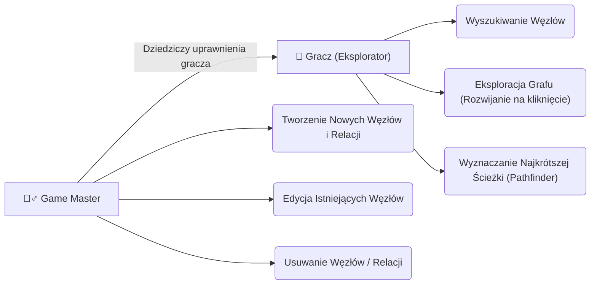
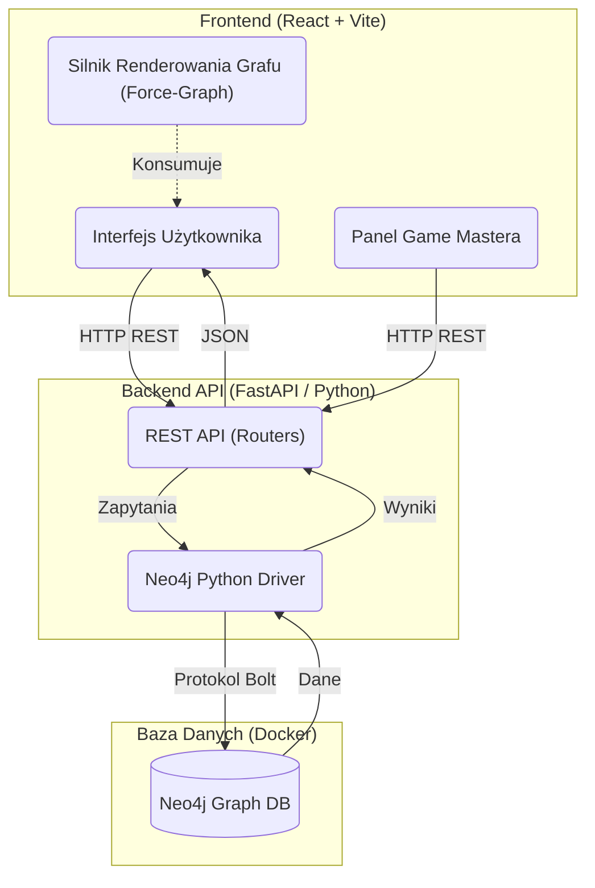
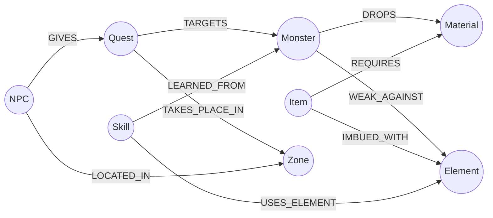

# RPG Graph Universe (Mitologia Nordycka)

**Wizualizacja i zarządzanie złożonymi zależnościami w grze fabularnej za pomocą grafowej bazy danych Neo4j.**

Projekt z przedmiotu Bazy Danych zrealizowany w oparciu o silnik grafowy (Neo4j). Głównym założeniem było wykazanie wyższości baz grafowych nad klasycznymi relacyjnymi bazami danych (RDBMS) w przypadku silnie powiązanych domen, takich jak systemy rzemiosła, zależności między potworami, żywiołami, misjami oraz ekwipunkiem w grach RPG. Całość osadzona jest w klimacie Mitologii Nordyckiej.

---

##  Główne Funkcjonalności

Aplikacja łączy w sobie potężny silnik grafowy ze stylizowanym interfejsem graficznym, oferując narzędzia zarówno dla graczy (eksploracja), jak i twórców gry (Game Master Mode). Wybór bazy Neo4j nie był przypadkowy – dla poniższych funkcjonalności podejście relacyjne wymagałoby skomplikowanych złączeń (JOIN) oraz trudnych w utrzymaniu, powolnych zapytań hierarchicznych (np. za pomocą CTE w SQL).

### 1. Eksploracja i Pobieranie Połączeń (Expand Node)
Zamiast pobierania danych ze złączeń wielu tabel (Item, Monster, NPC, Quest, itp.), co jest powolne w tradycyjnym SQL, Neo4j natywnie wspiera przechodzenie po grafie. Użytkownik podwójnie klikając na węzeł, natychmiastowo doczytuje tylko jego bezpośrednich sąsiadów, zapobiegając przeładowaniu przeglądarki i zachowując stały czas zapytania ($O(1)$) bez względu na całkowity rozmiar grafu.

**Wykorzystywane zapytanie Cypher:**
```cypher
MATCH (n)-[r]-(m)
WHERE elementId(n) = $node_id
RETURN n, r, m
LIMIT 50
```

### 2. Pathfinder (Wyszukiwanie Najkrótszej Ścieżki)
Wyznaczenie trasy między dwoma encjami (np. jak dojść od zdobycia danego Surowca, przez Potwora do Zleceniodawcy) w SQL wymaga pisania skomplikowanych i niewydajnych rekursywnych Common Table Expressions (Recursive CTE). W bazach grafowych zadanie to rozwiązują wbudowane, silnie zoptymalizowane algorytmy grafowe (np. algorytm Dijkstry).

**Wykorzystywane zapytanie Cypher (native shortestPath):**
```cypher
MATCH (start) WHERE elementId(start) = $source
MATCH (end) WHERE elementId(end) = $target
MATCH p = shortestPath((start)-[*]-(end))
RETURN nodes(p) as path_nodes, relationships(p) as path_rels
```

### 3. Logika RPG (Drzewa Craftingu i Ekwipunek)
Gdy gracz sprawdza recepturę (Crafting), system musi przejść przez ścieżkę wielokrotnych zależności: Przedmiot -> Wymaga -> Materiał -> Z którego leci -> Potwór. W SQL oznacza to liczne *LEFT JOIN*, podczas gdy Cypher umożliwia czytelne, wizualne modelowanie takich ścieżek za pomocą `OPTIONAL MATCH`. Pozwala to na niezwykle wydajne agregowanie głębokich drzew zależności na żywo.

**Generowanie drzewa craftingu z uwzględnieniem szansy dropu potworów:**
```cypher
MATCH (i:Item)-[req:REQUIRES]->(mat:Material)
WHERE elementId(i) = $item_id
OPTIONAL MATCH (mat)<-[drop:DROPS]-(m:Monster)
RETURN 
    elementId(mat) as mat_id,
    mat.name as material_name,
    req.quantity as quantity,
    collect({monster: m.name, chance: drop.chance}) as drops
```

### 4. Game Master Mode (Interaktywny CRUD na Grafie)
Dodawanie nowych powiązań między różnymi typami bytów (np. Potwór -> Słabość) w bazie relacyjnej pociąga za sobą konieczność tworzenia wielu tabel asocjacyjnych. Grafowe podejście pozwala na utworzenie dowolnej krawędzi (relacji) ze swoimi własnymi właściwościami (np. szansa wypadnięcia) bez uprzedniego modelowania skomplikowanego schematu bazy, co stanowi gigantyczną zaletę elastyczności grafu.

**Tworzenie dynamicznych relacji w locie:**
```cypher
MATCH (a) WHERE elementId(a) = $source_id
MATCH (b) WHERE elementId(b) = $target_id
CREATE (a)-[r:NOWA_RELACJA {property: "wartość"}]->(b)
```

---

##  Architektura Systemu i Stos Technologiczny

Aplikacja składa się z trzech ściśle współpracujących warstw, osadzonych w środowisku Docker.

### 1. Baza Danych: Neo4j (Grafowa)
Baza nie wymaga manualnej instalacji na systemie hosta. Została w pełni **skonteneryzowana za pomocą Dockera** (`docker-compose.yml`), który pobiera oficjalny obraz `neo4j:5`.
* **Protokół Bolt i Komunikacja:** Kontener udostępnia port `7474` dla interfejsu przeglądarkowego oraz kluczowy port `7687`. Jest to port **protokołu Bolt**, zoptymalizowanego, binarnego protokołu komunikacyjnego, przez który backend w Pythonie wysyła zapytania Cypher do bazy, uzyskując maksymalną przepustowość.
* **Wolumeny (Trwałość Danych):** Graf jest zapisywany w podmontowanych wolumenach lokalnych (`./neo4j/data`), co sprawia, że dane nie znikają po wyłączeniu lub zresetowaniu kontenera.
* **Rozszerzenia:** Za pomocą zmiennej `NEO4J_PLUGINS=["apoc"]` kontener przy pierwszym uruchomieniu automatycznie instaluje wtyczkę **APOC** (Awesome Procedures On Cypher).
* **Przykładowe Etykiety (Labels):** `Item`, `Material`, `Monster`, `Quest`, `NPC`, `Skill`, `Element`.
* **Przykładowe Relacje:** `REQUIRES`, `DROPS`, `WEAK_AGAINST`, `USES_ELEMENT`, `IMBUED_WITH`.

### 2. Backend: FastAPI (Python 3)
Wysoce zoptymalizowany serwer API bazujący na asynchroniczności, obsługujący zapytania Cypher przy pomocy oficjalnego sterownika Neo4j.
* Zrefaktoryzowana architektura oparta o moduły (Routers): `graph.py`, `nodes.py`, `links.py`, `game_logic.py`.

### 3. Frontend: React + Vite (TypeScript)
Zoptymalizowane pod kątem wydajności Single Page Application.
* `react-force-graph-2d`: Silnik renderowania grafów oparty na Canvas.
* Modułowa struktura komponentów.
* Customowy design wykorzystujący koncepcje ciemnego fantasy i RPG (np. czcionki `Cinzel Decorative`).

---

##  Instalacja i Uruchomienie

Projekt został w pełni skonteneryzowany. Wystarczy jeden skrypt, aby podnieść całe środowisko wraz z załadowaniem danych startowych (tzw. seed data).

**Wymagania:** `Docker` oraz `Docker Compose`.

### Uruchomienie
W głównym katalogu projektu wywołaj dostarczony skrypt:
```bash
./setup.sh
```
Skrypt ten:
1. Uruchamia komendę `docker compose up -d`, która stawia bazę, backend i frontend.
2. Wchodzi w inteligentną pętlę i systematycznie przepytuje bazę za pomocą `cypher-shell` komendą `RETURN 1`, oczekując na to, aż silnik javy Neo4j w pełni się uruchomi.
3. Po potwierdzeniu gotowości wywołuje jednorazowy skrypt `seed.py` na kontenerze backendu, który wypełnia pusty graf naszymi testowymi danymi (potwory, itemy, wikingowie).

### Adresy Aplikacji:
* **Frontend (Aplikacja RPG Graph):** [http://localhost:5173](http://localhost:5173)
* **Backend API (Swagger Docs):** [http://localhost:8000/docs](http://localhost:8000/docs)
* **Neo4j Browser (Baza Danych):** [http://localhost:7474](http://localhost:7474) (neo4j / rpg-password123)

---

##  Struktura Katalogów

```text
RPG-graph-project/
├── docker-compose.yml       # Orkiestracja całego stosu (Front, Back, DB)
├── setup.sh                 # Skrypt inicjujący (w tym seeding bazy)
├── backend/                 # Serwer API (FastAPI) podzielony na moduły
│   └── routers/             # Endpointy (graph, nodes, links, game_logic)
└── frontend/                # Interfejs Użytkownika (React, Vite, TS)
    └── src/components/      # UI podzielone na interaktywne moduły
```

---

##  Diagramy UML

Poniższe diagramy formalizują architekturę aplikacji oraz zamodelowany schemat bazy grafowej, spełniając klasyczne założenia inżynierii oprogramowania. (Diagramy są renderowane automatycznie przy użyciu składni **Mermaid**).

### 1. Diagram Przypadków Użycia (Use Case)

Prezentuje zakres możliwości dla poszczególnych aktorów w systemie.



### 2. Diagram Komponentów (Component Diagram)

Obrazuje przepływ danych pomiędzy niezależnymi warstwami aplikacji (Front, Back, DB).



### 3. Diagram Klas / Model Danych (Graph Schema Diagram)

Mimo braku klasycznego schematu w neo4j, poniższy diagram klas UML odzwierciedla relacje między typami (Etykietami) węzłów.

